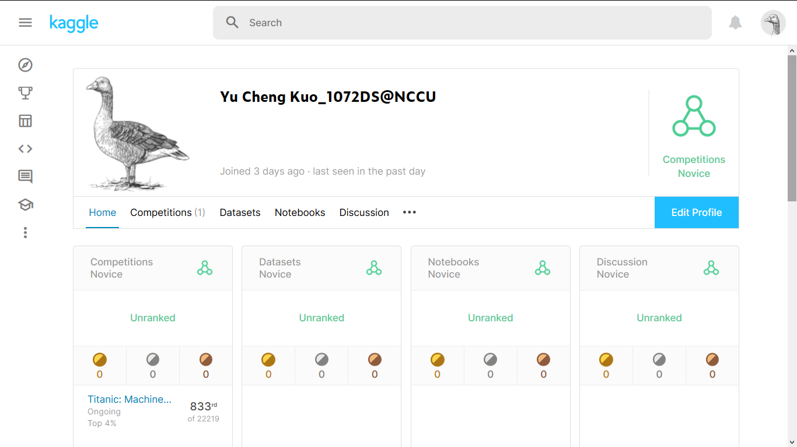

# Top_4_pct_Titanic_Kaggle
Top 4 % in ***Titanic: Machine Learning from Disaster***, a renowned competition on Kaggle, in 2020/05. 


## 1. Ranking 




## 2. Steps

1. Performing *n*-fold cross-validation on the training data under three-way split to select the best prediction model.
2. Reporting the average accuracy of cross-validation (training, validation, test in *n*-fold cross-validation).
3. Applying the selected model on the test data.

## 3. Reproducing outcome on training, validation & test data

```R
Rscript Titanic_Kaggle_Morton_Kuo.R --fold 5 --train Titanic_Data/train.csv --test Titanic_Data/test.csv --report performance1.csv --predict predict.csv
...
Rscript Titanic_Kaggle_Morton_Kuo.R --fold 10 --train Titanic_Data/train.csv --test Titanic_Data/test.csv --report performance6.csv --predict predict.csv
```


## 4. Reproducing outcome on test data

Here's the outcome I got around 2020/05; top 4% (833/22219) and 0.81339 accuracy. The right figure shows the different features I selected for Random Forest model. In addition, for the given train data at 2020/05 (I found on 2020/10/14 the dataset had changed. Kaggle deleted the feature "Name" probably for preventing cheats.), I got a accuracy 0.89 by Random Forest with 10-fold and 3-way validation.
