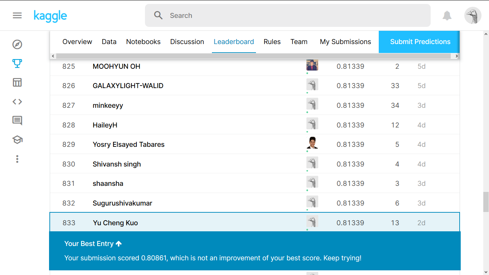
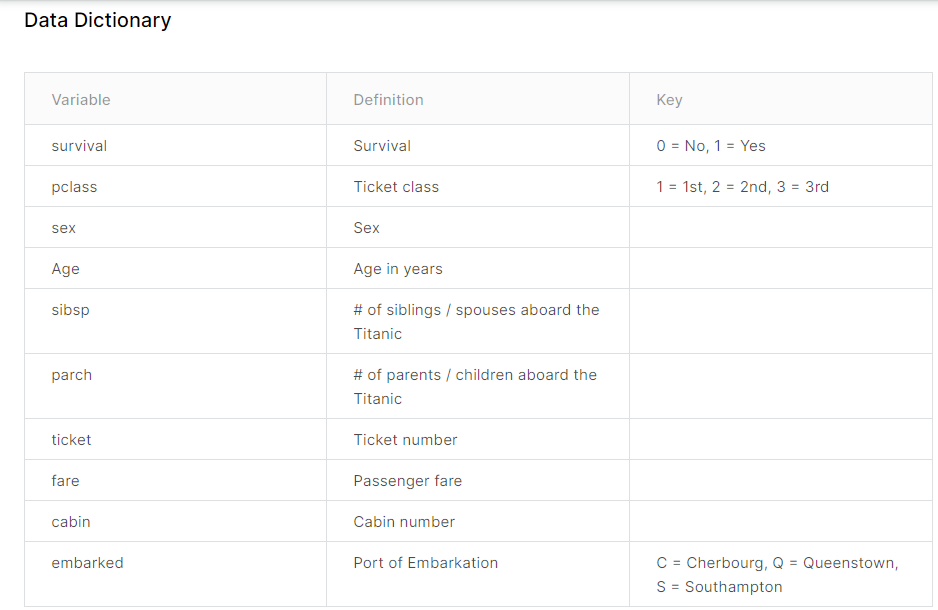

# Top_4_pct_Titanic_Kaggle
Top 4 % (833/22219) in **[Titanic: Machine Learning from Disaster](https://www.kaggle.com/c/titanic)**, a renowned competition on Kaggle, in 2020/05. This analysis is ***conducted with R***.


## 1. Ranking 




## 2. Dataset

The Titanic dataset here is retrieved from Kaggle in 2020/05. Notice that **the Titanic dataset has changed now**, so my top 4% ranking in Titanic disappeared. Kaggle ***deleted the feature "Name"***, probably for ***preventing cheating***, and resampled to get the new data. 

## 3. Steps

1. Performing **10-fold** cross-validation on the *training data given by Kaggle* under **3-way** split to select the best prediction model.
2. Reporting the average accuracy of cross-validation (training, validation, test in *n*-fold cross-validation).
3. Applying the selected model on the test data.

## 4. Reproducing Outcome on Training Data Given by Kaggle

I got a 0.89 accuracy on test data using **Random Forest** with 10-fold and 3-way validation on the whole training data given by Kaggle.

 \
Run the following snippet in "Terminal" of *RStudio* to get the outcome.
```R
Rscript Titanic_Kaggle_Morton_Kuo.R --fold 5 --train Titanic_Data/train.csv --test Titanic_Data/test.csv --report performance1.csv --predict predict.csv
...
Rscript Titanic_Kaggle_Morton_Kuo.R --fold 10 --train Titanic_Data/train.csv --test Titanic_Data/test.csv --report performance6.csv --predict predict.csv
```

## 5. The Public Leaderboard Ranking and Score on Kaggle

Top 4% (833/22219) and a 0.81339 accuracy on public leaderboard in 2020/05. However, you CAN'T get high ranking and score merely submitting my result since the Titanic dataset has changed.

## 6. Details

### 6-1 Introduction to Features

 \
This snapshot was taken in 2021/03. The feature "Name" has been deleted at this point. 

### 6-2 Missing Value Imputation
```R
mice.data <- mice(Raw,
                  m = 1,            
                  maxit = 50,      # max iteration
                  method = "rf", 
                  seed = 188,
                  print=FALSE)     
```

Actually, I made mistake called **"data leakage"**, a common mistake in DS & ML projects, while imputing the missing values. I merged the training, validation and test dataset, then imputing this merged dataset by Random Forest using mice(). I should have imputed the missing values of training, validation and test dataset respectively! This mistake might have caused overfitting.

### 6-3 Preprocessing

#### 6-3-1 Name
Again, notice that this feature doesn't exist in Titanic dataset on Kaggle anymore. Yet it existed in 2020/05, the time I carrying out this analysis. According to a resource on Kaggle, I categorized the titles as followed:\

A. "RARE" : "Jonkheer.", "the", "Don.", "Dona.", "Sir.", "Lady.", "Mme."\
B. "Prof": "Dr.", "Rev.", "Capt.", "Major.", "Col."\
C. "Mr": "Mr."\
D. "Master": "Master."\
E. "Mrs":"Mrs.", "Ms."\
F. "Miss": "Miss.", "Mlle."\

#### 6-3-2 Sex


#### 6-3-3 SibSp & Parch


#### 6-3-4 Ticket
After observing the cross-table of "the first alphabet of ticket" & "survival",  I classified the ticket numbers into 2 categories.

#### 6-3-5 Fare

#### 6-3-6 Pclass

#### 6-3-7 Cabin

#### 6-3-8 Embarked


### 6-4 Feature Selection / Feature Extraction
By leveraging stepwise linear regression with higher degree terms & interactions (using *stepwise()*), I was able to choose a few influential features.

### 6-5 Models
Then, I input those influential features to models, and tried combinations of those features in every model. The models I tried ranging from Linear Regression, SVM, Random Forest, XGBoost to ANN. Ultimately, I found that Ramdom Forest yielded the best outcome.

Here are a couple of best models I came by. Note that I didn't even adopt emsemble learning but already got a satisfactory ranking. 
```R
fold1_rf   = randomForest( Survived ~ Title + Family_size:Sex_Survival + Fare + Embarked , data= Titanic_train , ntree = 1000, importance = F)
fold1_rf01 = randomForest( Survived ~ Title + Family_size:Sex_Survival + Fare + Embarked , data=Titanic_train , ntree = 1000, importance = F)
fold1_rf02 = randomForest( Survived ~ Title + Family_size:Sex_Survival + Fare:Age + Embarked + Ticket_02 , data=Titanic_train , ntree = 1000, importance = F)
```
